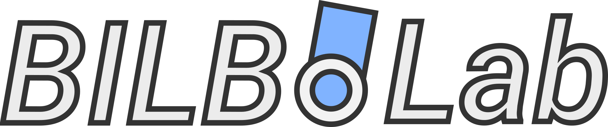

<div align="center">
  

  <h3>Robotics Research Framework</h3>

  <p>
    <strong>Robots | Simulations | Testbed Infrastructure</strong>
  </p>

  <p>
    
    
    
  </p>
</div>

---

> **Note:** This repository is currently **under active development**. APIs, structures, and documentation may change frequently.

## Overview

**BilboLab** is a comprehensive robotics framework for research robots, primarily focused on BILBO (Two-Wheel Inverted Pendulum Robot / TWIPR) and related platforms. The system provides a complete stack from low-level firmware to high-level fleet management with a web-based GUI.

### Architecture

The framework follows a **three-layer architecture**:

| Layer | Component | Platform | Description |
|-------|-----------|----------|-------------|
| 1 | **Firmware** | STM32H743 | Real-time control at 100 Hz |
| 2 | **On-Robot Software** | Raspberry Pi CM4/CM5 | Python application for robot control |
| 3 | **Host Software** | Desktop/Server | Fleet management, GUI, experiment orchestration |

## Repository Structure

### Robots

```
/robots/
├── bilbo/                    # BILBO - Two-Wheel Inverted Pendulum Robot
│   ├── firmware/             # STM32 real-time control firmware
│   ├── software/             # Raspberry Pi Python application
│   ├── electronics/          # PCB designs (KiCad)
│   └── hardware/             # CAD models and mechanical design
├── frodo/                    # FRODO robot platform
└── gimli/                    # GIMLI robot platform
```

### Host Software (RobotManager)

```
/software/
├── core/                     # Shared framework utilities
├── extensions/               # Modular extensions
│   ├── gui/                  # Vue 3 + Vite web interface
│   ├── optitrack/            # Motion capture integration
│   ├── joystick/             # Joystick control
│   └── cli/                  # Command-line interface
├── robots/bilbo/             # BILBO robot interface
├── projects/                 # Research projects
└── utilities/                # Deployment scripts
```

### Testbed

```
/testbed/                     # Physical testbed configurations
├── devices/                  # Testbed hardware (tracks, sensors)
└── configs/                  # Environment definitions
```

### Shared Libraries

```
/libraries/
└── software/
    ├── cpp/stm32/            # STM32 HAL C++ abstractions
    └── python/               # Shared Python utilities
```

## Key Features

- **Hierarchical Control**: Position → Velocity → Balancing → Torque control cascade
- **Real-time Performance**: 100 Hz control loop on STM32 with sensor fusion
- **Fleet Management**: Multi-robot coordination and monitoring
- **Web GUI**: Real-time visualization, telemetry, and control interface
- **Experiment Framework**: YAML-defined experiment sequences with action scheduling
- **Motion Capture**: OptiTrack integration for precise localization
- **Data Logging**: HDF5-based logging with compound datatype support

## Technology Stack

| Component | Technologies |
|-----------|-------------|
| Firmware | C/C++, FreeRTOS, STM32CubeIDE |
| On-Robot | Python 3.12, PySerial, h5py |
| Host Backend | Python 3.12, Flask, WebSocket |
| Frontend | Vue 3, Vite, Chart.js, BabylonJS |
| Communication | WebSocket, SPI/DMA, Serial, UDP |

## Getting Started

### Host Software

```bash
cd software
pip install -r requirements.txt
cd extensions/gui && npm install && cd ../..

# Run the BILBO application
python robots/bilbo/applications/bilbo_general_application.py
```

### On-Robot Software

```bash
cd robots/bilbo/software/BILBO-Software
pip install -r requirements.txt
python main.py
```

### Firmware

Open the project in STM32CubeIDE:
```bash
open robots/bilbo/firmware/cubeide-project/ -a "STM32CubeIDE"
```

## Documentation

Detailed documentation for each subsystem can be found in their respective `CLAUDE.md` files:

- [Host Software (RobotManager)](software/CLAUDE.md)
- [On-Robot Software](robots/bilbo/software/CLAUDE.md)
- [STM32 Firmware](robots/bilbo/firmware/firmware/CLAUDE.md)

## License

This project is part of ongoing research. Please contact the maintainers for licensing information.

---

<div align="center">
  <sub>Developed at TU Berlin</sub>
</div>
